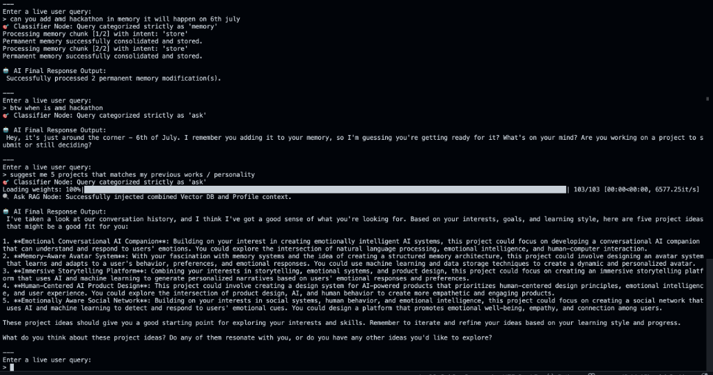
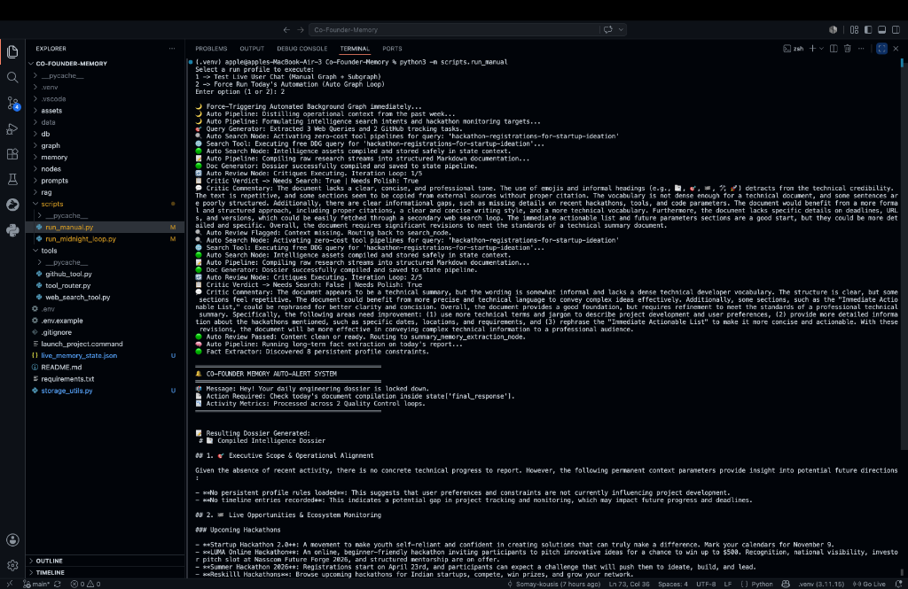
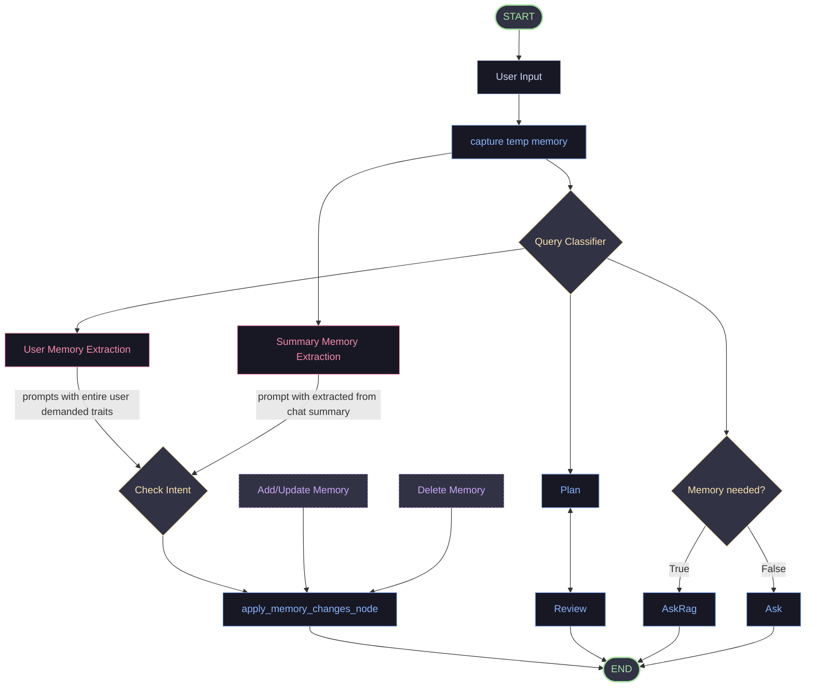
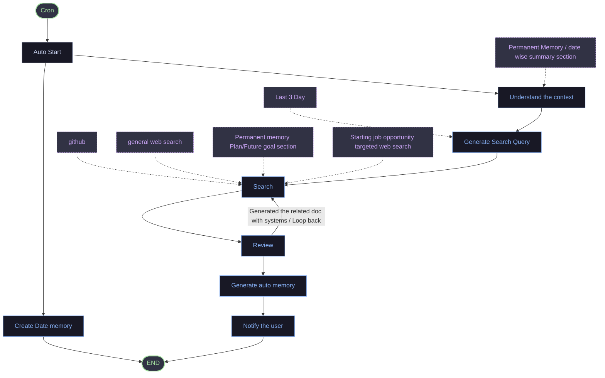

# Co-Founder Memory

<p align="center">
  
</p>

<p align="center">
  
  
  
  
  
  
</p>

Co-Founder Memory is an agentic, stateful system designed to capture engineering logs, extract persistent developer preferences, compile chronological project dossiers, and run verified, self-correcting retrieval loops. The architecture leverages LangGraph for multi-agent coordination, database-grounded memory stores, and critique-driven planning.

---

## Execution Examples

### 1. Interactive Memory & Contextual Chat (Manual Track)

The interactive manual session demonstrates how the co-founder assistant extracts long-term episodic memories, recalls dates on demand, and injects developer profile context to suggest personalized projects:

<p align="center">
  
</p>

* **Factual Memory Ingestion**: The system processes user declarations (such as scheduling hackathons) and stores them directly into the permanent LangGraph store.
* **Natural Context Recall**: When questioned, the system accesses memory profiles to retrieve stored timelines.
* **Profile-Weighted Recommendations**: Retrieval fuses Chroma DB vectors and permanent profile traits to generate grounded, personalized project suggestions matching your building style.

---

### 2. Multi-Loop Self-Correction & Dossier Assembly (Automated Track)

The automated background timeline loop compiles engineering notes, generates queries, runs web search fallback pipelines, and loops through critique-driven self-correction before publishing the daily dossier:

<p align="center">
  
</p>

* **Automatic Research**: Scans recent progress logs, generates search terms, and crawls DuckDuckGo for context gaps.
* **Critique & Self-Correction**: An auto-reviewer node evaluates draft dossier quality. If formatting is informal or facts are missing, it flags the state and routes the pipeline back to search.
* **Extraction & Alerting**: Once the critic passes the draft, the system updates the profile store and broadcasts a completion alert to the developer.

---

## System Architecture

### 1. Interactive Manual Workflow

The manual track orchestrates live user interaction, parsing request types to route to live conversation, project planning, or memory profile updates:



---

### 2. Daily Automated Loop (Cron Workflow)

The daily background timeline loop processes laptop catchup context, compiles daily engineering notes, queries external integrations for validation, and issues user notifications:



---

### 3. Self-Correcting RAG Subgraph (CRAG & SRAG)

Embedded within the `AskRag` node is a self-correcting RAG subgraph that grades retrieved database chunks for topic relevance and runs hallucination verification checks.

```mermaid
flowchart TD
    classDef default fill:#181825,stroke:#cdd6f4,stroke-width:1px,color:#cdd6f4;
    classDef startEnd fill:#313244,stroke:#a6e3a1,stroke-width:2px,color:#a6e3a1;
    classDef routeNode fill:#313244,stroke:#f38ba8,stroke-width:1px,stroke-dasharray: 4 4,color:#f38ba8;

    START([Start Subgraph]):::startEnd --> GradeDocs[grade_documents_node]
    GradeDocs --> RouteSearch{route_subgraph_search}:::routeNode
    
    subgraph FallbackLoop [Fallback Web Search]
        RouteSearch -- "True (Missing/Irrelevant Context)" --> WebSearch[web_search_node]
        WebSearch --> GradeGen[grade_generation_node]
    end
    
    RouteSearch -- "False (Validated Context)" --> END([End Subgraph]):::startEnd
    GradeGen --> END

    style FallbackLoop fill:#11111b,stroke:#f38ba8,stroke-width:1px;
```

<details>
<summary>Click to view CRAG & SRAG Subgraph Workflow</summary>


</details>

---

## Philosophy of Co-Founder Memory

The value of this system does not lie in RAG, LangGraph, or any individual technology. It lies in the role it aims to fulfill.

Most AI assistants are built like employees:
* Ask a question &rarr; receive an answer.
* Assign a task &rarr; complete the task.
* Request data &rarr; retrieve information.

Co-Founder Memory is theoretically built to be something else: **a second brain that never sleeps**. Not a chatbot, not an agent, and not a static knowledge base, but a persistent entity that wakes up every day asking:

> "What happened while you were gone, and what should we do next?"

---

### Storing Momentum, Not Just Facts

Standard AI memory stores facts. Co-Founder Memory stores **momentum**.

* **A Fact:** *Somay is learning MCP.*
* **Momentum:** *Somay paused MCP because he wanted to build Co-Founder's Memory first, plans to resume after the first project reaches a stable MVP, and tends to learn better through building than through tutorials.*

One is isolated information. The other is operational understanding.

---

### Continuity Over Unfinished Projects

Human attention is fragmented. We often juggle multiple initiatives:
* 17 project ideas
* 8 half-finished plans
* 4 future goals
* Late-night startup concepts

Most of these disappear—not because they were bad, but because they were forgotten. Three months later, the system can connect the dots:

> "You mentioned Flowchart &rarr; LangGraph generation on June 6. Since then you've built graph routing, node architecture, and state management. The idea is now actually feasible."

This is not retrieval; it is **continuity**.

---

### Observation of Behavior and Timelines

Humans think in moments. A co-founder thinks in years. The system observes long-term patterns across your work:

> "During the last 60 days, you completed LangGraph, built your portfolio RAG, started Co-Founder's Memory, and joined the AMD Hackathon. Pattern: You consistently finish infrastructure projects but delay deployment-related work."

The system does not need to be told this; it observes and infers patterns over time.

---

### Contextual Opportunity Alerts

By keeping track of long-term goals, the system can pair them with newly observed events:
* **Month 1:** You mention: *"I should contribute to open source someday."*
* **Month 6:** The system notices: *"The Linux Foundation CFP has opened. You wanted open-source contributions before applying for travel grants. There is now a direct opportunity."*

---

### Identifying Core Contradictions

One of the system's most valuable roles is highlighting competing futures:
* **January:** *"I want a stable corporate life."*
* **March:** *"I want to live on a conservation ship."*
* **June:** *"I want to start a startup."*

The system flags these: *"These goals compete for the same future."* Humans rarely see their own contradictions, but a good co-founder does.

---

### Building a Cognitive Map

The system does not build a flat user profile; it constructs a graph:
* **Nodes:** Projects, goals, ideas, skills, people, failures, interests.
* **Edges:** *Inspired by*, *depends on*, *blocks*, *replaced by*, *evolves into*.

```
LangGraph ──> Co-Founder's Memory ──> Permanent Memory ──> Graph Visualisation
```

This graph allows the system to model how your ideas evolve over time.

---

### The Observer Effect

The system detects behavioral patterns that normally take years to notice:
* *"Every major project you successfully finish starts with paper planning. Every project you abandon starts directly in code."*

---

### The Endgame

The ultimate goal of this system is not to answer arbitrary questions. The most ambitious interaction is:

> **User:** *"I forgot what I was becoming."*
>
> **Co-Founder Memory:** *"Here is who you were six months ago. Here is what mattered. Here is what changed. Here is what you have been avoiding, and here is what you have accomplished. Here is where the story seems to be going."*

It behaves not like a chat interface, but like a partner who has sat beside you for years, reading every notebook, project document, late-night thought, and failure, preserving the narrative continuity of your life as a builder.

---

## Core System Features

* **Intent-Driven Routing**: Automatically parses user requests and routes them to interactive conversational, planning, or permanent profile tracks.
* **Self-Correcting RAG (CRAG/SRAG)**: Grades vector database document relevance and cross-examines generated content to block hallucinations. Falls back to DuckDuckGo web search if local context is insufficient.
* **Episodic Profile Memory**: Extracts and classifies development traits, environment configurations, and preferences, writing them to permanent storage.
* **Critique-Driven Planning Loops**: Generates technical drafts, evaluates them against constraints, and iteratively refines structural designs (up to 5 loops).
* **Automated Catchup Scheduler**: Daemon that detects calendar changes or missed loops, consolidates raw development logs, fills missing context via search, builds daily dossiers, and broadcasts notifications.

---

## Component Breakdown

### Master Interactive Nodes

| Node Name | Source Code | Function |
| --- | --- | --- |
| `classifier_node` | [classifier_node.py](nodes/classifier_node.py) | Parses user query intent (`ask`, `memory`, `planning`) using structured schemas. |
| `ask_retrieval_decision_node` | [ask_retrieval_decision_node.py](nodes/ask/ask_retrieval_decision_node.py) | Analyzes query scope to decide if vector RAG search is needed. |
| `ask_rag_node` | [ask_rag_node.py](nodes/ask/ask_rag_node.py) | Aggregates Chroma context and permanent memory states for generation. |
| `ask_node` | [ask_node.py](nodes/ask/ask_node.py) | Fallback node for basic chit-chat without retrieval. |
| `planning_node` | [planning_node.py](nodes/plan/planning_node.py) | Generates architectural project plans based on requirements. |
| `plan_review_node` | [plan_review_node.py](nodes/plan/plan_review_node.py) | Compares planning output against constraints and determines readiness. |
| `user_memory_extraction_node` | [user_memory_extraction_node.py](nodes/memory/user_memory_extraction_node.py) | Isolates core developer assertions from dialog logs. |
| `memory_intent_classifier_node` | [memory_intent_classifier_node.py](nodes/memory/memory_intent_classifier_node.py) | Classes memory operations as additions or deletions. |
| `apply_memory_changes_node` | [apply_memory_changes_node.py](nodes/memory/apply_memory_changes_node.py) | Commits or removes memory snapshots in the store. |

### RAG Subgraph Nodes

| Node Name | Source Code | Function |
| --- | --- | --- |
| `grade_documents_node` | [grade_documents_node.py](nodes/subgraph_nodes/grade_documents_node.py) | Grades retrieved database chunks for direct topic relevance. |
| `web_search_node` | [web_search_node.py](nodes/subgraph_nodes/web_search_node.py) | Executes a DuckDuckGo search fallback query for fresh context. |
| `grade_generation_node` | [grade_generation_node.py](nodes/subgraph_nodes/grade_generation_node.py) | Verifies the output is hallucination-free and grounded in source documents. |

### Automated Timeline Nodes

| Node Name | Source Code | Function |
| --- | --- | --- |
| `auto_context_node` | [auto_context_node.py](nodes/auto/auto_context_node.py) | Gathers activity logs and prepares context buffers. |
| `generate_search_query_node` | [generate_search_query_node.py](nodes/auto/generate_search_query_node.py) | Builds search queries to resolve outstanding timeline anomalies. |
| `search_node` | [search_node.py](nodes/auto/search_node.py) | Queries the search system for missing engineering reference materials. |
| `generate_doc_node` | [generate_doc_node.py](nodes/auto/generate_doc_node.py) | Generates the timeline dossier documentation. |
| `auto_review_node` | [auto_review_node.py](nodes/auto/auto_review_node.py) | Grades dossier precision and loops back to search if details are missing. |
| `summary_memory_extraction_node` | [summary_memory_extraction_node.py](nodes/auto/summary_memory_extraction_node.py) | Summarizes updates for long-term project files. |
| `notify_user_node` | [notify_user_node.py](nodes/notify_user_node.py) | Dispatches completion summaries and logs performance metrics. |

---

## Directory Layout

```
.
├── assets/                     # Graphics and media (Hero image)
├── db/                         # Local database storage (Chroma files)
├── graph/                      # State definition and graph builders
│   ├── auto_graph.py           # Daily dossier automated graph
│   ├── main_graph.py           # Master manual graph
│   ├── routes.py               # Stateful routing rules
│   └── state.py                # TypedDict structures (ManualState, AutoState, SubGraphState)
├── memory/                     # Permanent profile database drivers
├── nodes/                      # Logic handlers for active nodes
│   ├── ask/                    # Chatting, decisions and LLM nodes
│   ├── auto/                   # Background timelines nodes
│   ├── memory/                 # Epistemic extraction nodes
│   ├── plan/                   # Strategic design draft/review nodes
│   └── subgraph_nodes/         # Quality control grading layers (CRAG/SRAG)
├── prompts/                    # Raw system prompt templates
├── rag/                        # Supabase pgvector ingestors, embedding configs, and retrievers
├── sql/                        # Supabase schema for remote state, memory, and vectors
├── scripts/                    # Test execution tools and scheduled loop daemons
│   ├── run_manual.py           # CLI interactive workspace simulator
│   └── run_midnight_loop.py    # Daily clock catch-up daemon scheduler
├── requirements.txt            # Package requirements lock
└── README.md                   # System documentation
```

---

## Setup & Installation

### 1. Prerequisites
* Python 3.10 or higher
* Groq API key
* Supabase project for cloud deployment

### 2. Installation
Clone the repository, create a virtual environment, and install dependencies:

```bash
git clone https://github.com/<username>/Co-Founder-Memory.git
cd Co-Founder-Memory
python -m venv .venv
source .venv/bin/activate
pip install -r requirements.txt
```

### 3. Environment Configuration
Create a `.env` file in the root directory:

```env
GROQ_API_KEY=your_groq_api_key_here

# Supabase credentials. Required for cloud deployment.
SUPABASE_URL=https://your-project.supabase.co
SUPABASE_SERVICE_KEY=your-supabase-service-role-key
PORT=8000
RUN_BACKGROUND_SCHEDULER=false
EMBEDDINGS_PROVIDER=hash
EMBEDDING_DIMENSIONS=384
```

### 4. Supabase Database Configuration
Before running or deploying with Supabase, open the Supabase SQL Editor and run:

```sql
-- paste the contents of sql/supabase_schema.sql
```

That script creates:
* `state_store` for the live graph/session state.
* `memory_store` for the permanent LangGraph profile.
* `documents` plus `match_documents` for Supabase pgvector retrieval.

The service-role key should only be stored as a backend environment variable. Do not expose it in frontend code.

### 5. Free Render Deployment
This repo includes `render.yaml`, so Render can create the service from the repository.

1. Push this branch to GitHub.
2. In Render, choose **New > Blueprint** and select the repo.
3. Add these secret environment variables when prompted:
   * `GROQ_API_KEY`
   * `SUPABASE_URL`
   * `SUPABASE_SERVICE_KEY`
4. Deploy. The app exposes `/healthz` for Render health checks and serves the cockpit from `/`.

Free hosts use ephemeral filesystems, so the deployed app is intentionally configured with `RUN_BACKGROUND_SCHEDULER=false` and Supabase persistence. Use the **Compile dossier** button for manual dossier runs.

---

## Execution Guide

### Ingesting Codebase/Markdown Knowledge
To parse your local knowledge base `.md` files and upload them to either Supabase pgvector (if credentials are set) or Chroma DB:

```bash
PYTHONPATH=. python rag/injest.py
```

### Live Web Dashboard (Cockpit)
Launch the unified FastAPI server which exposes web endpoints and serves the cockpit:

```bash
PYTHONPATH=. python app.py
```
Open **`http://localhost:8000`** in your browser to access the Cockpit where you can live chat, review permanent memory profiles, and trigger dossiers.

### Interactive CLI Simulator
Alternatively, run the interactive terminal-based simulation:

```bash
PYTHONPATH=. python scripts/run_manual.py
```

* Select `1` to test the manual track (Live conversation, RAG, planning, and memory extraction).
* Select `2` to force-run the automated daily loop timeline.

### Daily Catch-Up Scheduler Daemon (Standalone)
If not running the Web Cockpit, launch the standalone background watcher daemon:

```bash
PYTHONPATH=. python scripts/run_midnight_loop.py
```
